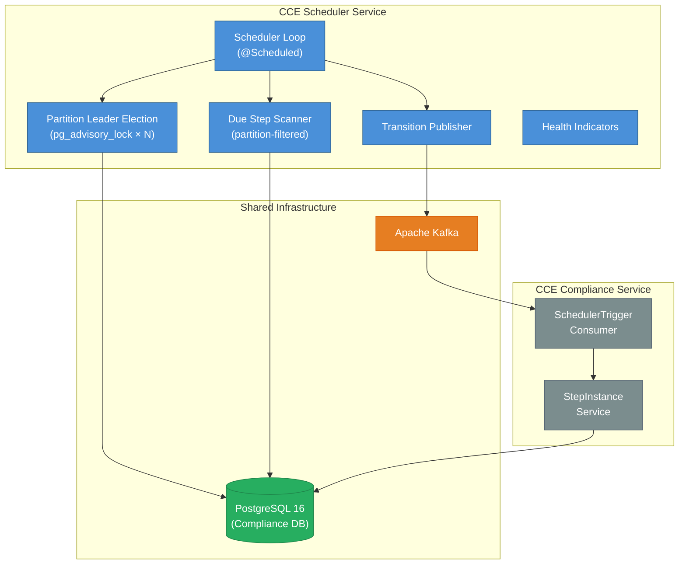

# Architecture & Design

## 1. System Context

The **CCE Scheduler Service** is a headless background service within the CCE platform. It drives time-based step state transitions by polling the Compliance Service's `step_instance` table and publishing transition requests to Kafka. It has **no REST API endpoints** — communication with the Compliance Service is exclusively via Kafka.



**This service does NOT handle:** event ingestion, protocol matching, step completion, deviation detection, analytics, authentication, or any REST API operations.

---

## 2. Technology Stack

| Concern | Technology | Version |
|---------|------------|---------|
| Language | Java | 21 (LTS) |
| Framework | Spring Boot | 3.4.x |
| Build tool | Gradle | 8.x |
| Database | PostgreSQL | 16+ (shared with Compliance Service) |
| Message broker | Apache Kafka | 3.7+ (KRaft mode) |
| DB access | Spring Data JPA + Hibernate | (Spring Boot managed) |
| DB migration | Flyway | (Spring Boot managed) |
| Connection pool | HikariCP | (Spring Boot default) |
| Observability | Micrometer + Prometheus | (Spring Boot managed) |
| Testing | JUnit 5, Testcontainers | |

### Key Gradle Dependencies

```groovy
// Spring Boot starters
implementation 'org.springframework.boot:spring-boot-starter'
implementation 'org.springframework.boot:spring-boot-starter-data-jpa'
implementation 'org.springframework.boot:spring-boot-starter-actuator'
implementation 'org.springframework.boot:spring-boot-starter-web'  // for actuator endpoints
implementation 'org.springframework.kafka:spring-kafka'

// Database
runtimeOnly 'org.postgresql:postgresql'
implementation 'org.flywaydb:flyway-core'
implementation 'org.flywaydb:flyway-database-postgresql'

// Observability
implementation 'io.micrometer:micrometer-registry-prometheus'

// Testing
testImplementation 'org.springframework.boot:spring-boot-starter-test'
testImplementation 'org.springframework.kafka:spring-kafka-test'
testImplementation 'org.testcontainers:postgresql'
testImplementation 'org.testcontainers:kafka'
testImplementation 'org.testcontainers:junit-jupiter'
```

---

## 3. Package Structure

```
src/main/java/org/openphc/cce/scheduler/
├── SchedulerServiceApplication.java          # @SpringBootApplication + @EnableScheduling
├── config/
│   ├── SchedulerProperties.java              # @ConfigurationProperties(prefix = "cce.scheduler")
│   ├── SchedulingConfig.java                 # Thread pool (2 threads)
│   ├── JpaConfig.java                        # JPA/Hibernate settings
│   ├── KafkaProducerConfig.java              # Kafka producer factory
│   └── ObservabilityConfig.java              # MeterBinder for custom metrics
├── domain/
│   ├── model/
│   │   ├── StepInstance.java                 # Read-only entity (@Immutable)
│   │   ├── SchedulerLease.java               # Singleton lease entity
│   │   ├── TransitionLog.java                # Transition audit log entity
│   │   ├── StepStateSnapshot.java            # Pre-computed state counts entity
│   │   └── enums/
│   │       ├── StepState.java                # PENDING, DUE, OVERDUE, MISSED, COMPLETED, SKIPPED
│   │       └── TransitionType.java           # PENDING_TO_DUE, DUE_TO_OVERDUE, OVERDUE_TO_MISSED
│   └── repository/
│       ├── StepInstanceRepository.java       # Read-only queries + batch protocol_definition_id lookup
│       ├── SchedulerLeaseRepository.java     # Lease upsert
│       ├── TransitionLogRepository.java      # Transition log persistence
│       └── StepStateSnapshotRepository.java  # Snapshot upsert (COALESCE-based conflict)
├── engine/
│   ├── SchedulerLoop.java                    # @Scheduled main loop with leader guard
│   ├── DueStepScanner.java                   # PostgreSQL query + transition determination
│   ├── DueStep.java                          # Record: stepInstanceId, protocolInstanceId, transitionType, thresholdDate, metadata, actionId
│   ├── TransitionPublisher.java              # Orchestrates Kafka publish per DueStep
│   ├── PublishResult.java                    # Record: successCount, publishedSteps
│   ├── TransitionLogService.java             # Batch transition logging with N+1 prevention
│   └── StepStateSnapshotService.java         # Periodic snapshot refresh
├── health/
│   └── LeaderHealthIndicator.java            # Custom health indicator for leader status
├── kafka/
│   ├── SchedulerTriggerMessage.java          # Kafka message record
│   └── SchedulerTriggerProducer.java         # Kafka template wrapper
└── leader/
    └── LeaderElection.java                   # pg_advisory_lock lifecycle

src/main/resources/
├── application.yml
├── application-docker.yml
└── db/migration/
    ├── V1__create_scheduler_lease.sql
    ├── V2__create_transition_log.sql
    ├── V3__create_step_state_snapshot.sql
    ├── V4__fix_snapshot_unique_constraint.sql
    └── V5__add_partition_index_idx.sql

src/test/java/org/openphc/cce/scheduler/      # Unit tests
src/integrationTest/java/org/openphc/cce/scheduler/  # Integration tests
```

**Total:** ~25 source files across 8 packages.

---

## 4. Component Interactions

### 4.1 Scan-Publish Cycle

The core loop runs on a `@Scheduled(fixedDelay)` cadence (default: 5 seconds). The `fixedDelay` ensures no overlap — the next cycle starts only after the previous cycle completes.

Each instance only scans the **partitions** it owns (determined by acquired advisory locks). A single instance may own multiple partitions. With `total-partitions=1` (default), the behavior is identical to a single-leader model scanning the full table.

```
1. Partition leader check (any pg_advisory_locks held?)
   - If no locks held → skip this cycle, return immediately
2. For each owned partition P in ownedPartitions:
   a. DueStepScanner.scan(batchSize, P, totalPartitions)
      - Query step_instance for rows where time thresholds are met
      - Filter: MOD(ABS(HASHTEXT(protocol_instance_id::text)), totalPartitions) = P
      - Determine transition type for each row
      - Return List<DueStep>
   b. TransitionPublisher.publishAllWithResult(dueSteps, P)
      - For each DueStep: build SchedulerTriggerMessage, publish to Kafka synchronously
      - Track success/failure counts
      - Return PublishResult (successCount, publishedSteps)
   c. TransitionLogService.logTransitions(publishedSteps, P)
      - Batch-resolve protocol_definition_ids (single query for all protocol_instance_ids)
      - Persist TransitionLog entries for each successfully published step
   d. Record metrics (scan duration, batch size, transitions by type, partition=P)
3. StepStateSnapshotService.refreshSnapshot()
   - UPSERT global state counts from step_instance into step_state_snapshot
4. Wait fixedDelay → repeat
```

### 4.2 Partitioned Leader Election Lifecycle

#### Why do we need this?

Without partitioning, only **one instance** can scan the `step_instance` table at a time (single-leader). As the number of protocol instances grows, a single scanner becomes a throughput bottleneck. The Partitioned Leader Election Lifecycle allows **multiple instances to scan concurrently** by dividing the data space into non-overlapping partitions, each processed independently — achieving horizontal scale-out without duplicate processing or coordination overhead.

#### What is a partition?

A **partition** is a logical slice of the `step_instance` table determined by a hash of `protocol_instance_id`:

```
partition(row) = MOD(ABS(HASHTEXT(protocol_instance_id::text)), totalPartitions)
```

- `totalPartitions` (N) is set via configuration (`cce.scheduler.total-partitions`).
- Each partition is identified by an index **P** in the range `[0, N-1]`.
- A given `protocol_instance_id` always maps to the **same** partition, ensuring deterministic, conflict-free assignment without shared state.
- Partitions are purely logical — no physical table partitioning is involved.

#### What is the advisory lock for?

Each partition is guarded by a **PostgreSQL session-level advisory lock** (`pg_try_advisory_lock(baseKey + P)`). The lock serves as:

1. **Distributed mutex** — guarantees that exactly one instance scans a given partition at any point in time, preventing duplicate Kafka events.
2. **Failure detector** — advisory locks are automatically released when the holding database connection drops (instance crash, network failure), enabling surviving instances to take over immediately.
3. **Zero-infrastructure coordination** — no external system (ZooKeeper, etcd, Redis) is required; PostgreSQL itself provides the consensus.

The lock is held for the **lifetime of the dedicated JDBC connection** (not per-transaction), so it persists across scan cycles without re-acquisition overhead.

#### Concurrency model

The service supports **greedy partitioned multi-leader** concurrency via multiple PostgreSQL advisory locks. Each partition is an independent scan domain — N partitions allow up to N instances to process concurrently. Each instance acquires **all available** locks on startup, so it may own multiple partitions. This guarantees zero orphaned partitions regardless of how many instances are deployed.

With `total-partitions=1` (default), the behavior is identical to the original single-leader model.

```
Startup:
1. Create dedicated JDBC connection (outside HikariCP pool)
2. ownedPartitions = []
3. For i in 0..totalPartitions-1:
   a. Call pg_try_advisory_lock(advisoryLockKey + i) — non-blocking
   b. If acquired → add i to ownedPartitions, update scheduler_lease row for partition i
4. If ownedPartitions is empty → standby
   If ownedPartitions is non-empty → leader (scans all owned partitions)

Standby:
- Retry all unacquired locks every leaderRetryInterval (default: 5s)
- Scan loop skips processing on each cycle

Rebalancing on new instance joining:
- New instances can only acquire locks not held by existing instances
- To rebalance, an existing instance must be restarted (releases its locks)
- Kubernetes rolling restart naturally rebalances partitions across instances

Failover:
- When an instance dies, PG connection drops, ALL its advisory locks are released
- Surviving instances acquire the orphaned locks on next retry → no partitions left unprocessed

Shutdown (@PreDestroy):
- Release all held advisory locks
- Close dedicated connection
```

**Example with 3 partitions, 3 instances (even distribution):**
```
Instance A → acquires lock 100001 → owns [partition 0]
Instance B → acquires lock 100002 → owns [partition 1]
Instance C → acquires lock 100003 → owns [partition 2]
```

**Example with 3 partitions, 2 instances (greedy acquisition):**
```
Instance A (starts first) → acquires locks 100001, 100002, 100003 → owns [partition 0, 1, 2]
Instance B (starts second) → all locks taken → standby
```

**Example with 3 partitions, 2 instances (near-simultaneous start):**
```
Instance A → acquires locks 100001, 100002 → owns [partition 0, 1]
Instance B → acquires lock 100003 → owns [partition 2]
```

#### Balanced distribution strategy

The greedy acquisition model prioritizes **zero orphaned partitions** over perfectly equal distribution. However, to improve fairness during near-simultaneous startup, each instance introduces a **randomized micro-delay** (`0–50ms`, configurable via `cce.scheduler.lock-acquire-delay-ms`) between consecutive lock acquisition attempts:

```
For i in 0..totalPartitions-1:
   sleep(random(0, lockAcquireDelayMs))   // jitter between attempts
   pg_try_advisory_lock(advisoryLockKey + i)
```

This staggering gives concurrent instances a window to interleave their acquisitions, yielding a statistically more even distribution without sacrificing the guarantee that all partitions are always owned.

**For deterministic equal distribution**, use Kubernetes with `replicas = totalPartitions` and a rolling deployment strategy — each pod acquires exactly one partition as others have already claimed theirs by the time the next pod starts.

**Example with 3 partitions, 1 instance (safe — no orphans):**
```
Instance A → acquires locks 100001, 100002, 100003 → owns [partition 0, 1, 2] → scans all
```

### 4.3 Shared Database Access

The Scheduler connects to the **same PostgreSQL database** (`cce_collector`) as all other CCE services. The database is deployed by the CCE Collector Service.

| Table | Owner | Scheduler Access | Purpose |
|---|---|---|---|
| `step_instance` | Compliance Service | **Read-only** | Query for due transitions (partition-filtered) |
| `protocol_instance` | Compliance Service | **Read-only** | Resolve `protocol_definition_id` for transition logs (batch lookup) |
| `scheduler_lease` | Scheduler Service | **Read-write** | Partition leader heartbeats (one row per partition) |
| `transition_log` | Scheduler Service | **Read-write** | Append-only audit trail of triggered transitions |
| `step_state_snapshot` | Scheduler Service | **Read-write** | Pre-computed step state distribution (upsert) |
| All other tables | Compliance Service | **No access** | Not used by Scheduler |

**Important:** The Scheduler uses `@Immutable` on its `StepInstance` entity to prevent accidental writes. The actual state transitions are performed by the Compliance Service after consuming `SchedulerTriggerMessage` from Kafka.

---

## 5. Threading Model

| Thread Pool | Size | Purpose |
|---|---|---|
| `scheduler-pool` | 2 | @Scheduled task execution (scan loop + heartbeat) |
| HikariCP | 5 | JDBC connections for partition-filtered step_instance queries and lease updates |
| Kafka producer I/O | 1 | Kafka message publishing (synchronous) |
| Advisory lock | 1 | Dedicated JDBC connection for `pg_advisory_lock` (not from HikariCP) — holds all acquired partition locks |

---

## 6. Error Handling

| Error Source | Handling | Impact |
|---|---|---|
| PostgreSQL unreachable | Log error, skip this cycle, retry on next interval | Service remains running; catches up when DB recovers |
| Kafka broker unreachable | Log error per message, continue to next step in batch | Some transitions delayed; Kafka retries handle transient failures |
| Advisory lock lost | Detect on next heartbeat, release remaining locks, enter standby | Surviving instances acquire all orphaned partitions |
| Stale step (already transitioned) | Compliance Service ignores duplicate `SchedulerTriggerMessage` | No impact — idempotent consumer |
| Exception in scan loop | Catch-all in `@Scheduled` method — never terminates the scheduled task | Logged, metrics incremented, next cycle proceeds normally |

---

## 7. Observability

### 7.1 Metrics (Micrometer)

| Metric | Type | Tags | Description |
|---|---|---|---|
| `cce.scheduler.scan.duration` | Timer | `partition` | Time spent per scan cycle |
| `cce.scheduler.scan.steps` | Counter | `transition_type`, `partition` | Steps found per transition type |
| `cce.scheduler.publish.success` | Counter | `transition_type`, `partition` | Successful Kafka publishes |
| `cce.scheduler.publish.failure` | Counter | `transition_type`, `partition` | Failed Kafka publishes |
| `cce.scheduler.leader.status` | Gauge | `partition` | 1 = partition leader, 0 = standby |
| `cce.scheduler.cycle.count` | Counter | `partition` | Total scan cycles executed |

### 7.2 Health Indicators

| Indicator | Details |
|---|---|
| `leaderElection` | UP if leader election is functioning (regardless of leader/standby status). Reports `leader: true/false`, `ownedPartitions: [0,1]`, `totalPartitions`, `lastHeartbeat`. |
| `db` (auto) | PostgreSQL connectivity |
| `kafka` (auto) | Kafka broker connectivity |

### 7.3 Structured Logging

```
correlationId: sched-DUE_TO_OVERDUE-770e8400
stepInstanceId: 770e8400-e29b-41d4-a716-446655440002
transitionType: DUE_TO_OVERDUE
leaderStatus: true
ownedPartitions: [0,1]
currentPartition: 0
totalPartitions: 3
```

---

## 8. Scaling & Deployment

### 8.1 Greedy Partitioned Multi-Leader Model

The Scheduler supports **greedy partitioned multi-leader** concurrency for horizontal scaling. Each instance acquires **all available** advisory locks on startup, so a single instance can own and process multiple partitions. This eliminates orphaned partitions when fewer instances than partitions are deployed.

- **Default:** `total-partitions=1` — single-leader mode, identical to a traditional active-standby deployment.
- **Scaled:** `total-partitions=N` with any number of replicas — partitions are distributed greedily across available instances. Each instance scans all partitions it owns sequentially per cycle.
- **No orphaned partitions:** Even with 1 instance and `total-partitions=3`, that instance owns all 3 partitions and scans the full table. No data is ever missed.
- **No StatefulSet required** — uses a regular Kubernetes Deployment. Partition assignment is dynamic via greedy advisory lock acquisition.
- **Failover:** When an instance dies, ALL its locks are released. Surviving instances acquire the orphaned locks on their next retry (≤ `leaderRetryInterval`, default 5s).
- **Rebalancing:** Happens naturally during rolling restarts — restarted instances only acquire locks not yet held by others.
- **Stateless between runs** — all state is in PostgreSQL. An instance can be replaced at any time.

### 8.2 Deployment Examples

| Scenario | `total-partitions` | `replicas` | Behavior |
|---|---|---|---|
| Single instance | `1` | `1` | One leader, no failover |
| HA (no parallelism) | `1` | `2` | Active-standby, automatic failover |
| Parallel (3-way) | `3` | `3` | 3 concurrent leaders, each scans 1/3 of steps |
| Parallel + HA | `3` | `5` | 3 leaders (each owns 1 partition) + 2 standby spares |
| Under-provisioned (safe) | `3` | `1` | 1 instance owns all 3 partitions, scans full table sequentially |
| Under-provisioned (partial) | `3` | `2` | Partitions split ~2:1 across instances — no orphans |
