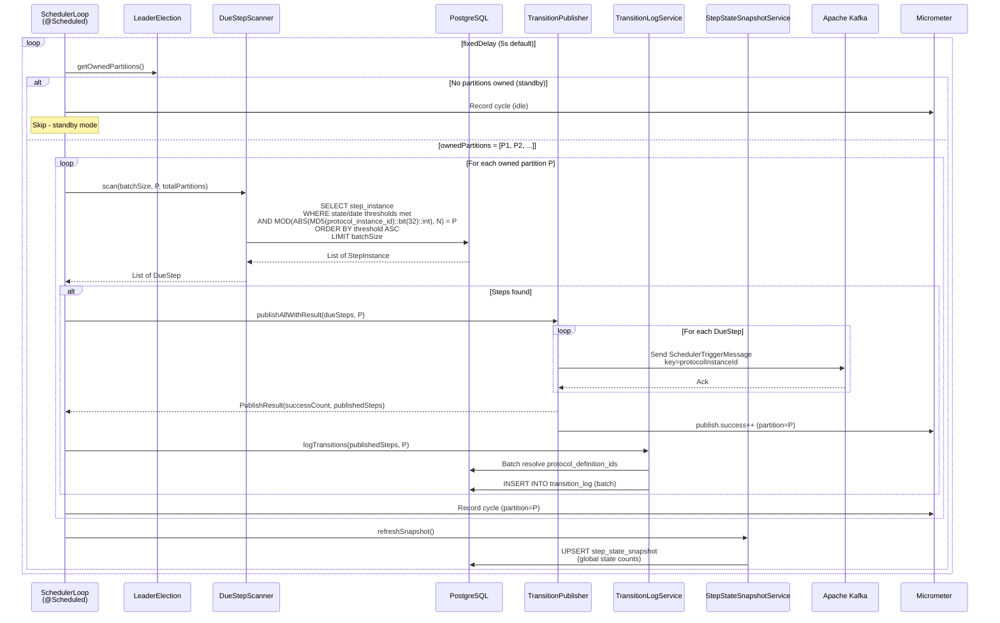
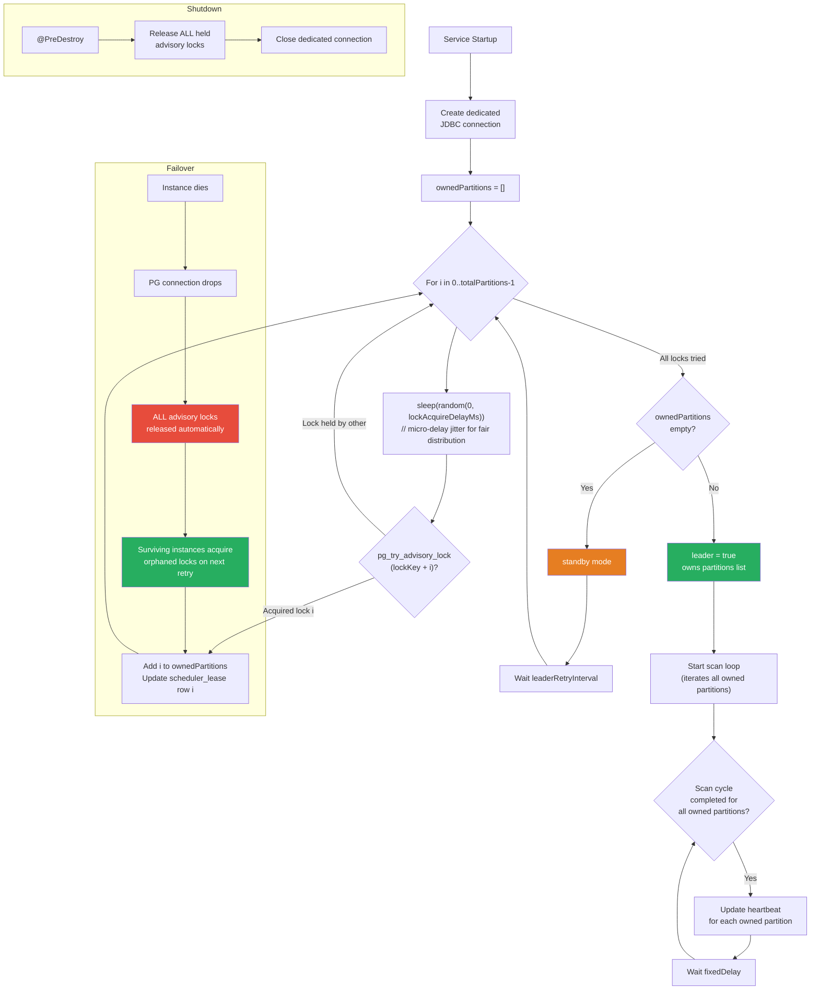
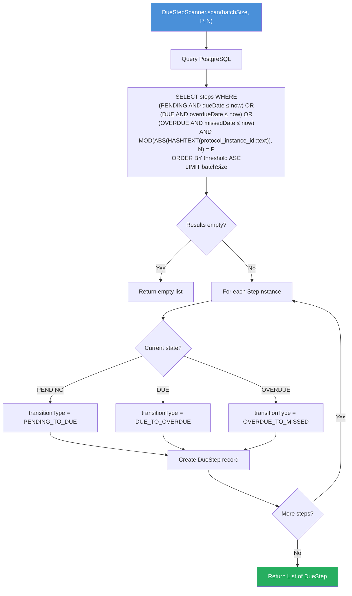
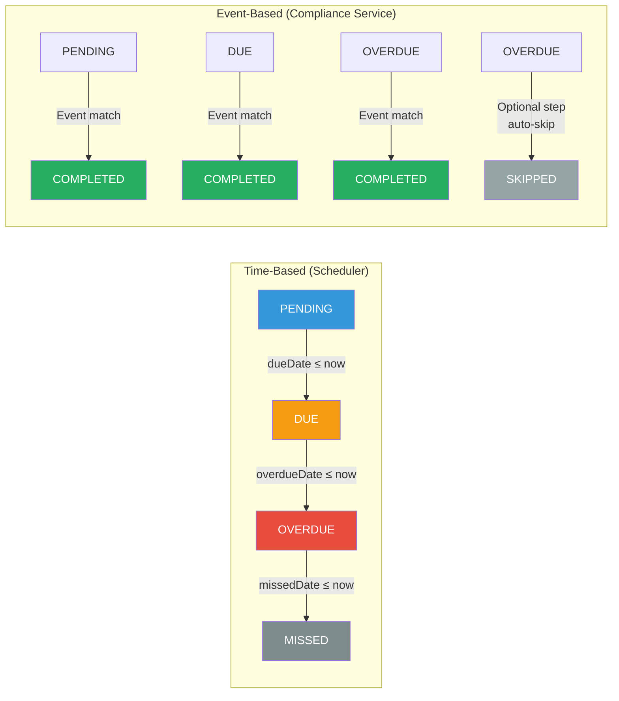
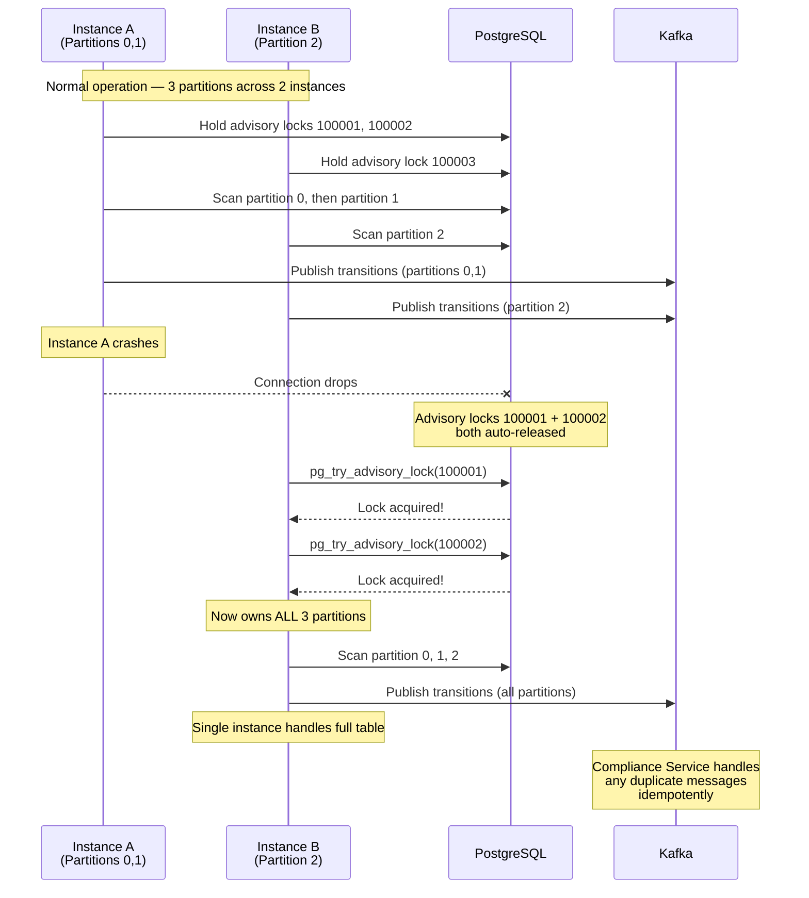

# CCE Scheduler Service — Flow Diagrams

All diagrams use Mermaid syntax for rendering in GitHub/IDE preview.

---

## 1. Scheduler Main Loop

The core scan-publish cycle that runs on every `fixedDelay` interval. Each instance scans **all partitions it owns** (may be multiple).



---

## 2. Greedy Partitioned Leader Election Lifecycle



---

## 3. Due Step Scanning Algorithm



> **P** = this instance’s `partitionIndex`, **N** = `totalPartitions`. When N=1, the `MOD(...)` clause is always 0 = P, effectively a no-op (full table scan).
### Indexing & Query Optimization Notes

**Indexes on `step_instance` (owned by Compliance Service):**

The Compliance Service defines the following indexes that benefit the Scheduler's polling query:

| Index | Columns | Purpose |
|-------|---------|--------|
| `idx_step_instance_state` | `state` WHERE `state IN ('PENDING', 'DUE', 'OVERDUE')` | Filters to only non-terminal (actionable) steps |
| `idx_step_instance_due_date` | `due_date` WHERE `state IN ('PENDING', 'DUE', 'OVERDUE')` | Scheduler time-based transitions — enables efficient range scans for threshold-crossing detection |

These **partial indexes** ensure PostgreSQL narrows down the candidate set to non-terminal steps with time thresholds *before* applying the partition filter.

**Optimization of `MOD(ABS(HASHTEXT(protocol_instance_id::text)), N) = P`:**

The hash-modulo partition filter is a non-indexable expression — it cannot leverage a B-tree index directly. However, the query is structured so that the **WHERE clause's time-based predicates** (indexed above) reduce the working set first, and the `MOD(...)` filter is applied only to the resulting rows. In practice:

1. Partial indexes reduce the scan to only rows in the matching status + time window.
2. The `MOD(HASHTEXT(...))` filter is then applied as a cheap CPU operation on the reduced set.
3. `LIMIT batchSize` caps the final output.

This keeps query cost low even without indexing the hash expression itself. If profiling shows the `MOD(...)` filter discarding too many rows (i.e., N is large and each partition gets 1/N of the pre-filtered set), consider a **functional index**:

```sql
CREATE INDEX idx_step_instance_partition ON step_instance (
    MOD(ABS(HASHTEXT(protocol_instance_id::text)), <N>)
) WHERE status IN ('PENDING', 'DUE', 'OVERDUE');
```

> **Note:** A functional index is tied to a specific value of N. If `total-partitions` changes, the index must be recreated. For most deployments (N ≤ 8), the filtered-scan approach above is sufficient without a functional index.
---

## 4. State Transition Determination



---

## 5. Failover Scenario (Greedy Partition Redistribution)


